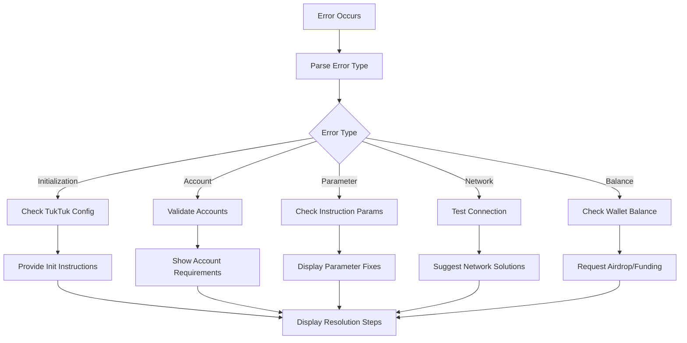

# Design Document

## Overview

This design addresses the TukTuk initialization and error handling issues in the Solana Kit implementation. The current memo.ts example fails due to missing TukTuk config initialization and poor error handling. We'll create a robust system that automatically detects initialization requirements, provides clear error messages, and guides users through setup.

## Architecture

The solution consists of several key components:

1. **TukTuk Validator**: Checks system prerequisites and TukTuk config status
2. **Error Handler**: Parses Solana errors and provides human-readable messages
3. **Initialization Helper**: Guides users through TukTuk setup process
4. **Type Safety Layer**: Handles BigInt/number conversions and type compatibility
5. **Enhanced Memo Example**: Improved version with comprehensive error handling

## Components and Interfaces

### TukTuk Validator

```typescript
interface TukTukValidator {
  validatePrerequisites(connection: Connection, wallet: KeyPairSigner): Promise<ValidationResult>;
  checkTukTukConfig(connection: Connection): Promise<ConfigStatus>;
  validateWalletBalance(connection: Connection, wallet: Address): Promise<BalanceStatus>;
  verifyProgramDeployment(connection: Connection): Promise<ProgramStatus>;
}

interface ValidationResult {
  isValid: boolean;
  issues: ValidationIssue[];
  recommendations: string[];
}

interface ConfigStatus {
  exists: boolean;
  isValid: boolean;
  address: Address;
  details?: TukTukConfigDetails;
}
```

### Error Handler

```typescript
interface ErrorHandler {
  parseSolanaError(error: SolanaError): ParsedError;
  formatErrorMessage(error: ParsedError): string;
  getResolutionSteps(error: ParsedError): string[];
}

interface ParsedError {
  type: 'ACCOUNT_NOT_FOUND' | 'INSUFFICIENT_FUNDS' | 'INVALID_INSTRUCTION' | 'SIMULATION_FAILED';
  message: string;
  details: Record<string, any>;
  resolutionSteps: string[];
}
```

### Initialization Helper

```typescript
interface InitializationHelper {
  generateInitCommands(network: 'devnet' | 'testnet' | 'mainnet'): string[];
  checkInitializationStatus(connection: Connection): Promise<InitStatus>;
  provideSetupInstructions(status: InitStatus): SetupInstructions;
}

interface SetupInstructions {
  steps: string[];
  commands: string[];
  documentation: string[];
}
```

### Type Safety Layer

```typescript
interface TypeSafetyLayer {
  convertToSolanaTypes(params: any): any;
  validateInstructionParams(instruction: any): ValidationResult;
  ensureAddressTypes(addresses: Record<string, any>): Record<string, Address>;
  handleBigIntConversions(values: Record<string, any>): Record<string, any>;
}
```

## Data Models

### TukTuk Configuration

```typescript
interface TukTukConfigDetails {
  authority: Address;
  minDeposit: bigint;
  nextTaskQueueId: number;
  minTaskQueueId: number;
  bumpSeed: number;
}
```

### Validation Models

```typescript
interface ValidationIssue {
  severity: 'ERROR' | 'WARNING' | 'INFO';
  code: string;
  message: string;
  resolution: string;
}

interface BalanceStatus {
  current: bigint;
  required: bigint;
  sufficient: boolean;
}

interface ProgramStatus {
  deployed: boolean;
  address: Address;
  version?: string;
}
```

## Error Handling

### Error Classification

1. **Initialization Errors**: Missing TukTuk config, uninitialized program
2. **Account Errors**: Missing accounts, insufficient permissions
3. **Parameter Errors**: Invalid instruction parameters, type mismatches
4. **Network Errors**: RPC failures, connection issues
5. **Balance Errors**: Insufficient SOL for transactions

### Error Resolution Flow



## Testing Strategy

### Unit Tests

1. **TukTuk Validator Tests**
   - Test prerequisite validation with various wallet states
   - Test config detection with existing/missing configs
   - Test balance validation with different amounts

2. **Error Handler Tests**
   - Test parsing of different Solana error types
   - Test error message formatting
   - Test resolution step generation

3. **Type Safety Tests**
   - Test BigInt/number conversions
   - Test Address type enforcement
   - Test instruction parameter validation

### Integration Tests

1. **End-to-End Memo Example**
   - Test complete flow from wallet loading to task completion
   - Test error scenarios (missing config, insufficient funds)
   - Test recovery from various error states

2. **Network Integration**
   - Test against devnet with fresh wallet
   - Test against devnet with existing TukTuk setup
   - Test error handling with network issues

### Error Scenario Tests

1. **Missing TukTuk Config**
   - Verify clear error message
   - Verify initialization instructions
   - Test recovery after manual initialization

2. **Insufficient Balance**
   - Test balance checking
   - Test airdrop suggestions
   - Test transaction retry after funding

3. **Invalid Parameters**
   - Test parameter validation
   - Test type conversion errors
   - Test instruction building failures

## Implementation Notes

### Solana-Kite Integration

- Use `connection.rpc.getAccountInfo()` for account existence checks
- Use `connection.getPDAAndBump()` for PDA derivation with validation
- Use `connection.sendTransactionFromInstructions()` with proper error handling
- Leverage solana-kite's built-in retry and confirmation logic

### Error Message Design

- Provide context about what operation was being attempted
- Include specific account addresses and transaction details
- Offer concrete next steps rather than generic advice
- Link to relevant documentation when appropriate

### User Experience

- Show progress indicators for long-running operations
- Provide clear success/failure feedback
